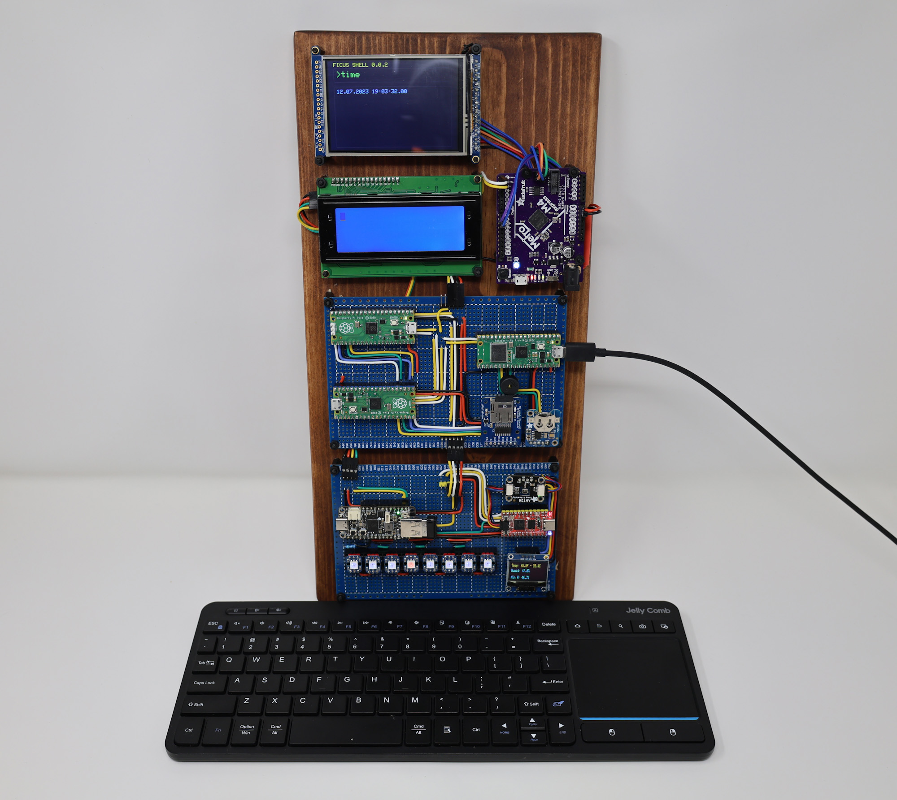
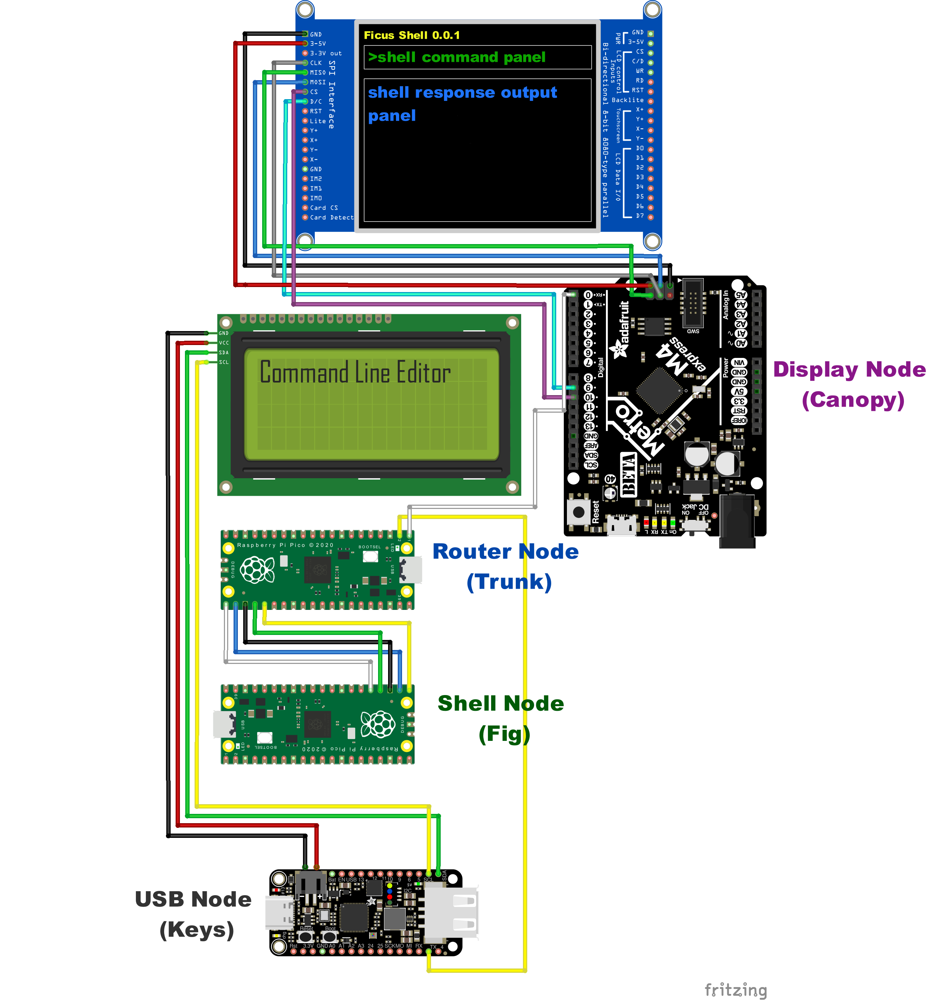

# FicusOS
This repository houses FicusOS, an operating system for the Ficus computer, a custom hardware architecture made from standard micro-controller units (MCUs). This is an experiment in building a custom operating system on a simplified architecture of multiple independent processing nodes.

## Ficus Hardware Architecture
The overall design philosophy for the Ficus architecture is based around the metaphor of its name-sake tree - with its complex, interconnected roots and branches. The reference implementation for the Ficus architecture is shown below. Each MCU represents a 'node' in the Ficus tree and performs a specific function.

The diagram below shows the core system and components. The primary communication between nodes is based on UART and the one-bit data bus is referred to as 'communication vines' in the Ficus metaphor.

## Ficus nodes:
The reference implementation is made up of 7 nodes and an accompanying web app:

### Ficus Canopy
This is the display node for the Ficus reference implementation. It processes incoming shell commands and responses and displays them on a 3.5' TFT screen. It features an Adafruit Metro M4 Express featuring ATSAMD51 for processing and displays on a 3.5" TFT 320x480 + Touchscreen Breakout Board w/MicroSD Socket - HXD8357D. The code is developed in C in Arduino IDE and depends on Phil Hower's Arduino-Pico core and Adafruit's Display library.

### Ficus Fig
Named after the fruit of the Ficus tree, this node implements user shell functions for the operating system. The reference implementation uses a Raspberry Pico, but any similar RP2040 with at least 2 UART connections would work. The node listens for incoming shell requests, looks across its designated search path (including user space programs) for a matching command, and executes it. Results are sent back to the router node for distribution to other nodes. This node is implemented in MicroPython for flexibility.

### Ficus Keys
This node provides USB keyboard input and command line editing. It is built on an Adafruit Feather RP2040 with a USB Type-A Host. The code is developed in C in Arduino IDE and depends on Phil Hower's Arduino-Pico core and TinyUSB.

### Ficus Leaf
This node provides environmental monitoring and blinkin' lights for user feedback. It's built on a Sparkfun RP2040 Pro Micro, but any RP2040 should work fine. The software is implemented using Adafruit's CircuitPython for hardware compatibility. This node listens for activity from the keyboard module and reacts to user input via the blinkin' lights. Additionally, it monitors an Adafruit AHT20 - Temperature & Humidity Sensor Breakout and displays current and record temps and humidity on a 0.96-inch OLED I2C IIC Display Module 12864 128x64 Pixel SSD1306.

## Ficus Roots
Roots reach outward, and this node provides essential networking support to the Ficus reference implementation. On startup, it connects to the Ficus Web App, requests a time update, and distributes that time across the data bus. If not online, it will read the current time from a battery-backed PCF8523 Realtime Clock breakout on an i2c connection and distribute that time. Since the PCF8523 is known to drift, the Roots node will overwrite PCF8523 time with network time when received. This node is implemented in MicroPython for flexibility.

### Ficus Trunx
Ficus is built on a 1-bit data bus, and most nodes are restricted to two UART connections at a time. This node is a basic routing node that is responsible for routing messages to the correct destination. In most cases, it broadcasts out to multiple listeners per channel. It listens directly to the USB input node and communicates bi-directionally with the shell node. For the reference implementation, this node runs on a Raspberry Pico RP2040. The code is implemented in C using the Raspberry Pico SDK.

### Ficus Web App
This is a web application written in Python Flask. It currently provides a time-sync capability used by the Roots node, but it may eventually be used to provide remote input and control of the Ficus computer.
