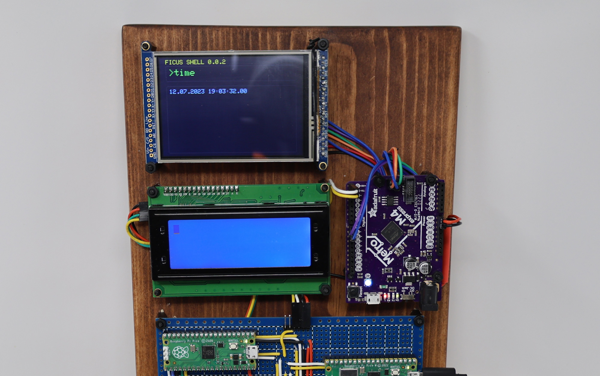

# FicusOS Canopy

This is the display node for the Ficus reference implementation. It processes incoming shell commands and responses and displays them on a 3.5' TFT screen. It features an Adafruit Metro M4 Express featuring ATSAMD51 for processing and displays on a 3.5" TFT 320x480 + Touchscreen Breakout Board w/MicroSD Socket - HXD8357D. The code is developed in C in Arduino IDE and depends on Phil Hower's Arduino-Pico core and Adafruit's Display library.

## Hardware Requirements

* Adafruit Metro M4 Express featuring ATSAMD51 - [see here](https://learn.adafruit.com/adafruit-metro-m4-express-featuring-atsamd51/overview).
* 3.5" TFT 320x480 + Touchscreen Breakout Board w/MicroSD Socket - HXD8357D - [see here](https://www.adafruit.com/product/2050)

