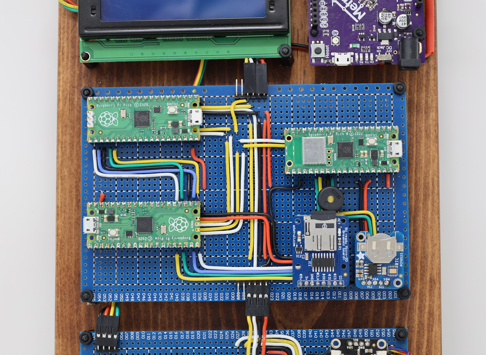

# FicusOS Fig
Named after the fruit of the Ficus tree, this node implements user shell functions for the operating system. The reference implementation uses a Raspberry Pico, but any similar RP2040 with at least 2 UART connections would work. The node listens for incoming shell requests, looks across its designated search path (including user space programs) for a matching command, and executes it. Results are sent back to the router node for distribution to other nodes. This node is implemented in MicroPython for flexibility.

In the image below, the Fig is the bottom Raspberry pico on the left side.



## Hardware Requirements

* Raspberry Pico (or similar RP2040 with 2 UART connections)

## Install Prequisites

Install pyserial
```
pip install pyserial
```
Install ampy

```
pip install adafruit-ampy
```

Interacting with the sd-card breakout requires sdcard support. We have included a 3rd party port from https://github.com/micropython/micropython/tree/master/drivers/sdcard - feel free to overwrite with your own implementation for any other device.


### Build to board

Get com port to update build.py
```
python -m serial.tools.list_ports -v
```

Update PORT constant in build.py and sync_back.py

```
PORT=<SOME VALUE>
```

Deploy OS to board:

```python build.py```

### Sync back from board

If you work on the files on the board, using Thonny or equivalent, use this script to sync them back to your computer.