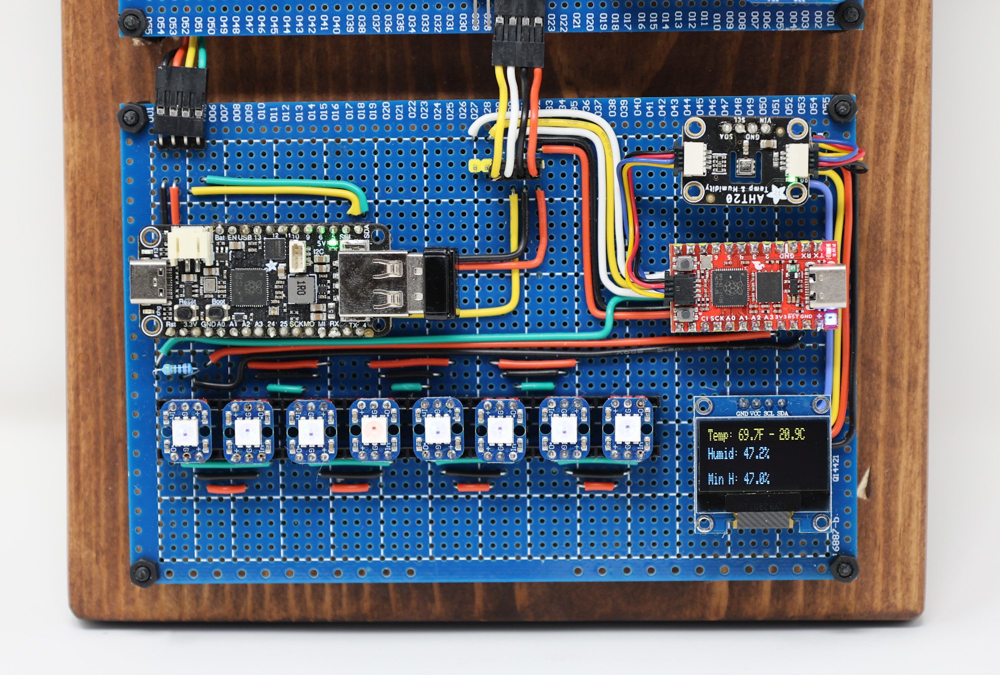

# FicusOS Keys
This node provides USB keyboard input and command line editing. It is built on an Adafruit Feather RP2040 with a USB Type-A Host. The node listens for incoming scan codes and converts them to ASCII. Key press events are sent to the Trunx node for processing and displayed on an LCD screen. The edited command is sent to the Trunx for processing when the user presses enter. The code is developed in C in Arduino IDE and depends on Phil Hower's Arduino-Pico core and TinyUSB.

In the image below, the Keys node is located on the lower left side.

## Hardware requirement

* Adafruit Feather RP2040 with USB Type A Host - [see here](https://www.adafruit.com/product/5723)
* 20x4 LCD Display (12c)

## Install pre-requisites
See Aduino IDE project for details. 