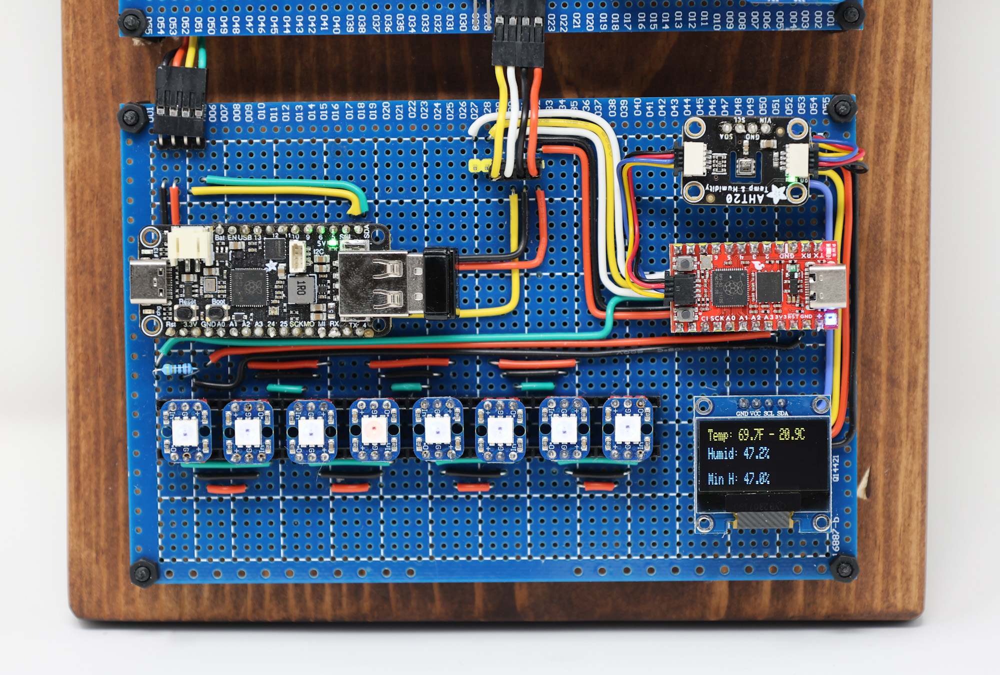

# FicusOS Leaf
This node provides environmental monitoring and blinkin' lights for user feedback. It's built on a Sparkfun RP2040 Pro Micro, but any RP2040 should work fine. The software is implemented using Adafruit's CircuitPython for hardware compatibility. This node listens for activity from the keyboard module and reacts to user input via the blinkin' lights. Additionally, it monitors an Adafruit AHT20 - Temperature & Humidity Sensor Breakout and displays current and record temps and humidity on a 0.96-inch OLED I2C IIC Display Module 12864 128x64 Pixel SSD1306.

In the image below, the leaf node is in the middle of the right side.



## Hardware requirements

* Sparkfun RP2040 Pro Micro (or similar)
* Neopixel chain
* 1306 OLED

## Install prerequisites

Requires Adafruit's CircuitPython 

## Install Libraries from Adafruit Bundle
Requires Adafruit Circuit Python libraries from their bundle of 'mpy' libraries.

[GitHub Adafruit CircuitPython Bundle](https://github.com/adafruit/Adafruit_CircuitPython_Bundle)

Copy the following into the devices lib/ folder

```
adafruit_bus_device/ (folder)
adafruit_bus_device.mpy
adafruit_ahtx0.mpy
adafruit_displayio_ssd1306.mpy
adafruit_framebuf.mpy
adafruit_pixelbuf.mpy
adafruit_ssd1306.mpy
neopixel.mpy
```

## Deploy to Device

Circuit Python devices will mount like an sdcard, so you can simply copy the single file `code.py` over to the device. See [Circuit Python Drives](https://learn.adafruit.com/welcome-to-circuitpython/the-circuitpy-drive) for more information.

Esnure that font5x8.bin is included next to code.py - this is used to render on the oled